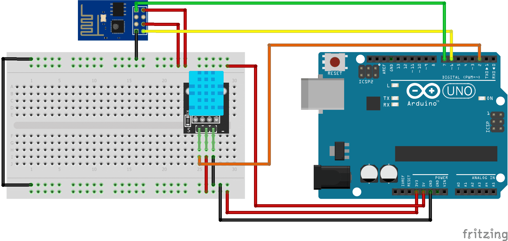

# ESP8266
send sensor values from arduino via WiFi to mysql database and display on webpage

First of all you need to set up your components just like the schematics below:    
 
Afterwards upload the sketch to your arduino and both of the php files to your webserver.
In order to make it work you will first need to create a table in your mysql database with the following query:
<pre>
   <code>
      CREATE TABLE sensor_data(
         id INT NOT NULL,
         temp VARCHAR (10),
         humidity  VARCHAR (10),
         time  VARCHAR (10),
         date  VARCHAR (10),       
         PRIMARY KEY (id)
      )
   </code>
</pre>
Additionally you'll need to download chart.js from https://www.chartjs.org/ to correctly display the diagrams. 
Note: The sketch will only work if you have already connected your ESP to a network before and
      saved configuration to flash. 
